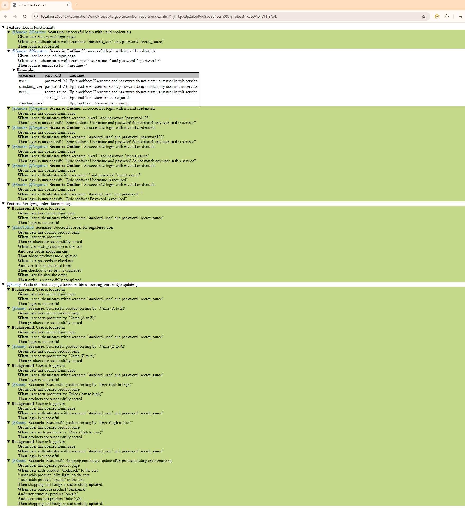

# Project Title
AutomationDemoProject

## Table of contents
* [Description](#description)
* [Technologies, languages and frameworks](#technologies-languages-and-frameworks)
* [Report](#report)
* [Setup](#setup)

## Description
This is a simple project that demonstrate how to automate the e-commerce web site https://www.saucedemo.com/
The tests included in the project verify the mostly used features of any e-commerce web site:
- Login functionality
- Product page functionalties:
  - sorting
  - filtering
  - adding to the cart
  - removing products
  - cart updating
- Checkout functionality
- Completing an order

## Report

## Technologies, languages and frameworks
Project is created with:
* Selenium WebDriver
* Java
* Maven
* JUnit
* POM with PageFactory
* Cucumber
* Gherkin

## Setup
### Prerequisites
Before running the program install:
* Java 8 or 11
* IntelliJ IDEA

### Executing program
* Clone the repo https://github.com/SashaGencheva/AutomationDemoProject.git
* Open the project in IntelliJ IDEA
* Run src/test/java/Runner/TestRunner.java file
